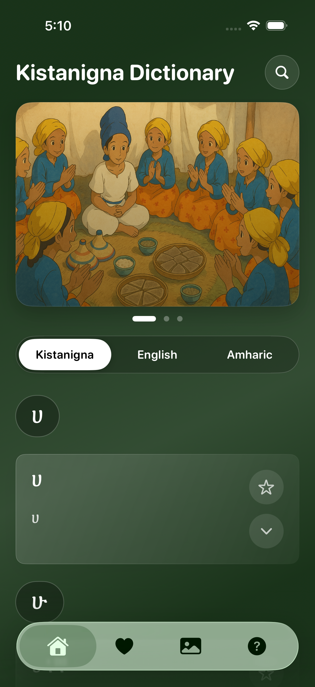
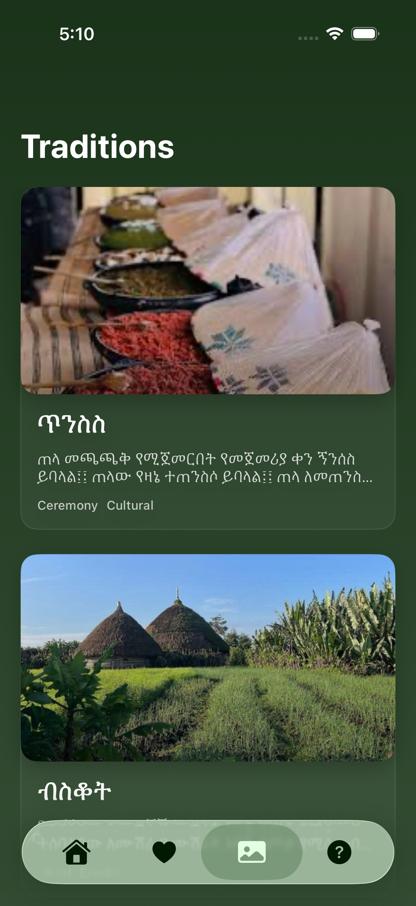
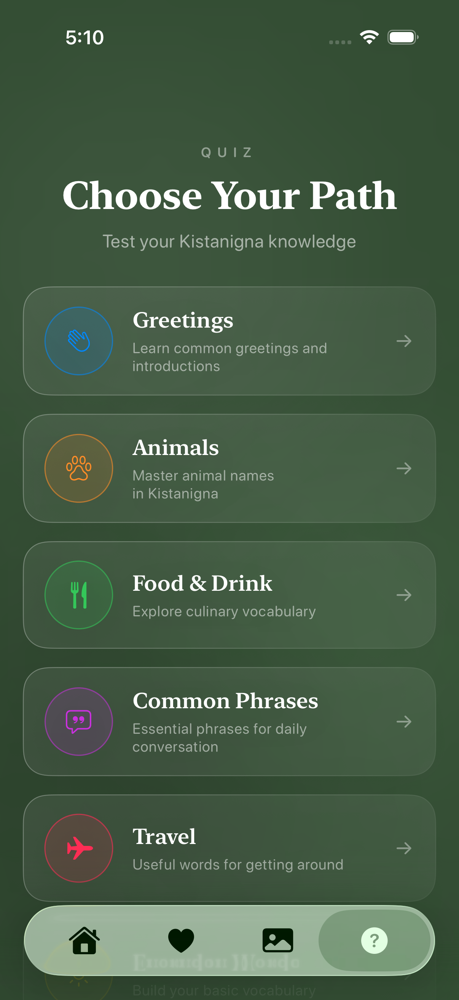

# Kistane Dictionary — iOS

An offline-first, multilingual dictionary and learning experience designed to make Kistanigna easier to access, learn, and preserve digitally.

**Kistanigna · English · Amharic**

<p>
  
  
  
</p>

## Product Tour

These screenshots were captured from the native SwiftUI app running on an iPhone simulator.

<table>
  <tr>
    <td align="center"></td>
    <td align="center"></td>
    <td align="center"></td>
  </tr>
  <tr>
    <td align="center"><strong>Trilingual dictionary</strong><br><sub>Browse and search 9,924 local records.</sub></td>
    <td align="center"><strong>Cultural context</strong><br><sub>Explore traditions through stories and imagery.</sub></td>
    <td align="center"><strong>Active learning</strong><br><sub>Practice vocabulary by topic.</sub></td>
  </tr>
</table>

## Why I Built It

Kistanigna is spoken by the Kistane community in Ethiopia and throughout the diaspora, but it has far fewer digital resources than widely supported languages. When a language is difficult to find in the tools people use every day, vocabulary and cultural knowledge become harder to pass on—especially for younger generations growing up away from home.

I built Kistane Dictionary to give the community a practical way to search words, study vocabulary, and explore traditions from an iPhone. The goal is modest but important: make Kistanigna easier to access today while helping preserve it in digital form for the future.

## Features

- Browse 9,924 local dictionary records across Kistanigna, English, and Amharic
- Search all three languages with exact, prefix, and substring relevance scoring
- Switch the primary display language without reloading the dataset
- Save favorite entries locally on the device
- Practice vocabulary through category-based, seven-question quizzes and answer review
- Explore six traditions with cultural descriptions and image galleries

## Architecture

The app uses a view-driven SwiftUI structure rather than a formal MVVM layer.

```text
SwiftUI app and tab navigation
            │
            ├── Dictionary and search views
            ├── Favorites views
            ├── Quiz views
            └── Traditions gallery
                       │
         View-owned application state
                       │
       DictionaryLoader + UserDefaults
                       │
           Bundled JSON dictionary
```

`DictionaryLoader` decodes the bundled JSON file into `DictionaryEntry` values. The home view loads a small preview first, then decodes and caches the complete dataset on a background queue. Search work is debounced and performed away from the main rendering path before grouped sections are applied to the UI.

Favorites are represented by stable entry keys and persisted with SwiftUI's `@AppStorage`, backed by `UserDefaults`. Quiz questions are generated locally from filtered dictionary entries; the app has no network dependency.

## Data and Search

Each dictionary record contains:

```swift
struct DictionaryEntry: Codable, Identifiable {
    let word: String
    let english: String
    let amharic: String
    let definition: String
}
```

The included JSON file contains 9,924 records. Search compares a lowercase query against all three language fields, then ranks exact matches above prefixes and prefixes above general substring matches. Results are grouped alphabetically when browsing and shown as one relevance-ranked section while searching.

## Tech Stack

- Swift 5
- SwiftUI
- Xcode project with iOS, unit-test, and UI-test targets
- Local JSON data
- `UserDefaults` through `@AppStorage`
- No third-party dependencies

## Project Structure

```text
kistane-ios/
├── Kistanigna Dictionary/
│   ├── Kistanigna_DictionaryApp.swift
│   ├── MainTabView.swift
│   ├── DictionaryEntry.swift
│   ├── DictionaryLoader.swift
│   ├── HomeTab.swift
│   ├── FavouritesTab.swift
│   ├── Quiz*.swift
│   ├── TraditionsGalleryView.swift
│   ├── Assets.xcassets/
│   └── kistanigna_trilingual_dictionary_FIXED.json
├── Kistanigna DictionaryTests/
├── Kistanigna DictionaryUITests/
└── SG Dictionary.xcodeproj/
```

The application source currently uses a flat Xcode synchronized group. Files are organized by feature through naming rather than nested source directories.

## Getting Started

1. Clone the repository.
2. Open `SG Dictionary.xcodeproj` in Xcode.
3. Select the `SG Dictionary` scheme and an iOS simulator or device.
4. Build and run.

The application target uses Swift 5 and has a minimum deployment target of iOS 15.6. Automatic signing may need to be configured locally when running on a physical device.

## Build and Testing

A Debug simulator build has been verified with:

```sh
xcodebuild \
  -project "SG Dictionary.xcodeproj" \
  -scheme "SG Dictionary" \
  -configuration Debug \
  -destination "generic/platform=iOS Simulator" \
  CODE_SIGNING_ALLOWED=NO \
  build
```

Run the unit tests with:

```sh
xcodebuild \
  -project "SG Dictionary.xcodeproj" \
  -scheme "SG Dictionary" \
  -destination "platform=iOS Simulator,name=iPhone 17 Pro" \
  CODE_SIGNING_ALLOWED=NO \
  test
```

The unit suite covers dictionary-entry decoding and stable identity, favorite-key persistence and legacy migration, duplicate handling, and multilingual search normalization and ranking. A UI smoke test launches the app and verifies navigation across the dictionary, favorites, traditions, and quiz tabs. High-value future coverage includes dataset integrity and deterministic quiz generation.

## Data and Media Rights

The dictionary dataset and cultural media are original project content maintained as part of Kistane Dictionary.

## License

No open-source license has been selected. The source is publicly viewable, but no permission for reuse, modification, or redistribution is granted by default.
